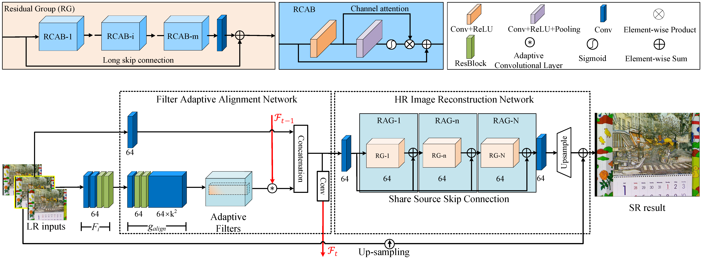

## STAN

PyTorch code for our TIP 2022 paper “Video Super-Resolution via a Spatio-Temporal Alignment Network” [Paper](https://ieeexplore.ieee.org/document/9700735) or [Researchgate](https://www.researchgate.net/publication/358314922_Video_Super-Resolution_via_a_Spatio-Temporal_Alignment_Network).

1. [Overview](https://github.com/wwlCape/STAN#Overview)
2. [Train](https://github.com/wwlCape/STAN#begin-to-train)
3. [Test](https://github.com/wwlCape/STAN#begin-to-test)
4. [Citation](https://github.com/wwlCape/STAN#Citation)
5. [Acknowledgements](https://github.com/wwlCape/STAN#Acknowledgements)


## Overview




## Train

#### Prerequisites

```
CUDA 10.2/gcc 5.4/PyTorch 1.4
```

#### Train a new model:

```
bash install.sh
python train.py -datasets_tasks W3_D1_C1_I1
```


## Test

`lists/train_tasks_W3_D1_C1_I1.txt`  specifies the dataset-task pairs for training and testing.

#### Test a model:

```
python test.py -method model_name -epoch N -dataset REDS4 -task SR_color/super-resolution
```

#### Pretrained Models

The pretrained model for STAN can be found from [here](https://drive.google.com/file/d/1vV-HIyKnVrNa8h2LVyRezleVmbwkVBy3/view?usp=sharing). 


## Citation

If you find the code and paper useful in your research, please cite:

```
@article{wen2022video,
  title={Video Super-Resolution via a Spatio-Temporal Alignment Network},
  author={Wen, Weilei and Ren, Wenqi and Shi, Yinghuan and Nie, Yunfeng and Zhang, Jingang and Cao, Xiaochun},
  journal={IEEE Transactions on Image Processing},
  volume={31},
  pages={1761--1773},
  year={2022},
  publisher={IEEE}
}
```

## Acknowledgement

This project is based on [[Learning Blind Video Temporal Consistency](https://github.com/phoenix104104/fast_blind_video_consistency)] and our filter  adaptive alignment module is based on[[STFAN](https://github.com/sczhou/STFAN)]. 

```
@inproceedings{zhou2019stfan,
  title={Spatio-Temporal Filter Adaptive Network for Video Deblurring},
  author={Zhou, Shangchen and Zhang, Jiawei and Pan, Jinshan and Xie, Haozhe and  Zuo, Wangmeng and Ren, Jimmy},
  booktitle={Proceedings of the IEEE International Conference on Computer Vision},
  year={2019}
}

@inproceedings{Lai-ECCV-2018,
    author    = {Lai, Wei-Sheng and Huang, Jia-Bin and Wang, Oliver and Shechtman, Eli and Yumer, Ersin and Yang, Ming-Hsuan}, 
    title     = {Learning Blind Video Temporal Consistency}, 
    booktitle = {European Conference on Computer Vision},
    year      = {2018}
}
```

